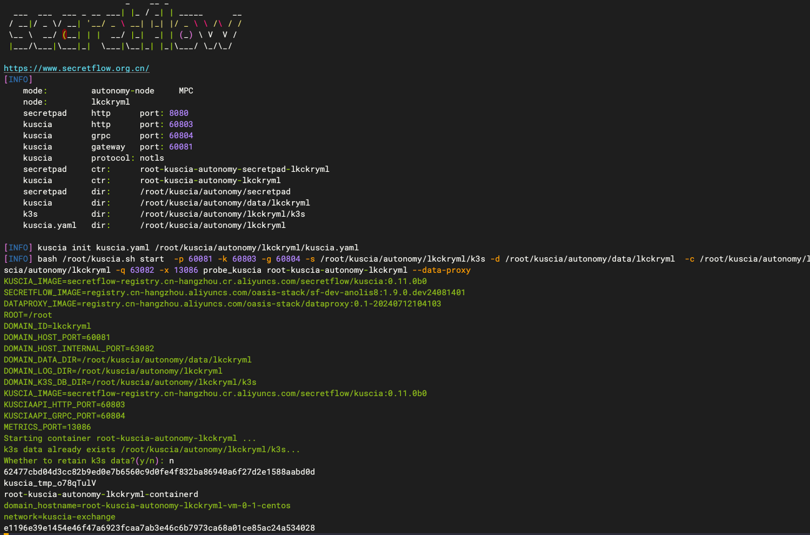

# P2P autonomy 节点部署

## 环境准备

请参考：[部署要求](./request.md)


## 第1步：节点注册、获取节点 ID 、获取节点令牌


* 进入我的机构，点击“新增计算节点”
* 填入节点名称，点击“确定”


* 点击切换节点
* 选择新增的节点


* 进入节点中心获取 ① 节点名称、 ② 部署token
* ③ 获取secretpad 的页面入口地址，表示当前注册机构的地址，作为后续-m参数使用

## 第2步：安装部署

若是同一网络内，则只需获取本机的 ip 地址即可，以 mac 为例，通过 ifconfig 命令获取③ip地址。
若是跨网部署，则需要运维人员生成外网IP。

部署包和 Secretpad 的部署包是同一个，所以直接下载解压 Secretpad 的部署包即可。参考[前置准备](./guide.md#前置准备)。

```shell
# ./install.sh autonomy-node -n ①平台的节点id -m ③ secretpad 的页面入口地址 -t ② 部署token
bash install.sh autonomy-node -n alice2 -g 18083 -k 18082 -p 18080 -q 13081 -P mtls  -m 'http://secretpad:8080' -t xdeploy-tokenx -x 13086
# 安装后可以到平台节点详情查看节点注册状态
```
命令参数可以参考[install.sh参数说明](./guide.md#installsh参数详解)



## 第3步：安装完成
看到 “[SUCCESS] HTTP success，code: 200” 则代表部署成功


## 第4步：部署验证
进入新注册节点中心，状态为“可用”即为部署成功


若在部署过程中有相关的问题或建议，可提交[Issues](https://github.com/secretflow/secretpad/issues)反馈。